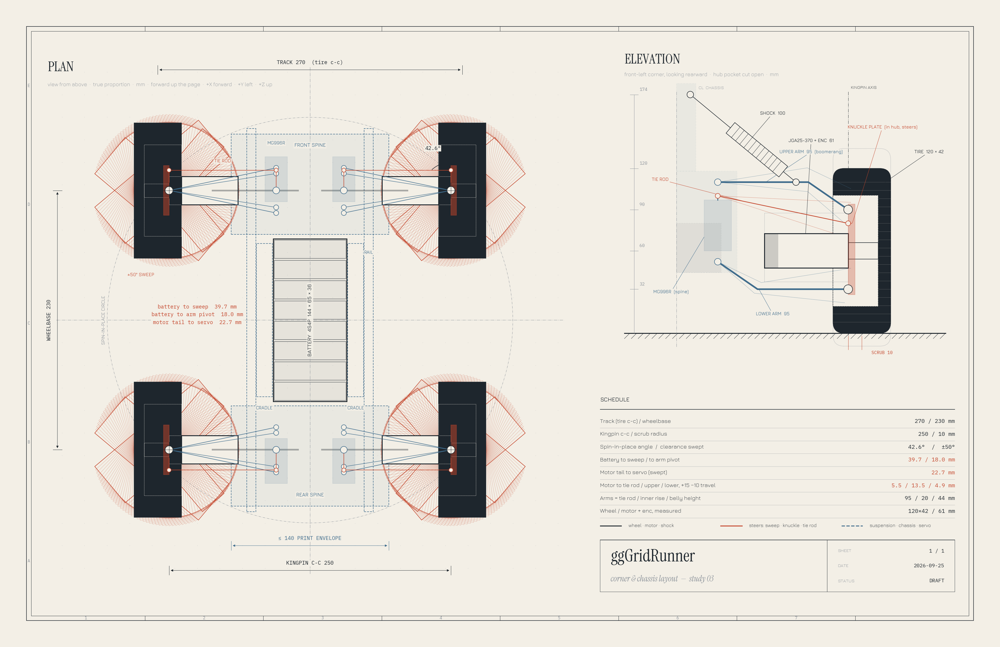

# Chassis & Corner Layout — Design Notes (DRAFT)

**Status:** in progress. **Resume at:** Section 2 detail sign-off (corner parts), then Section 3.
Section 1 (overall layout) is decided: **prototype-style double wishbone, 270 × 230, servo on the
chassis with tie rods, battery fore-aft** (study 03, 2026-09-25). This is not an approved spec.
`docs/hardware.md` has **not** been updated to match.

**Drawing:** [simulation/corner_layout_study.png](../../../simulation/corner_layout_study.png),
generated by [simulation/corner_layout_study.py](../../../simulation/corner_layout_study.py).
The plan view is forward-up. Rover frame: **+X forward, +Y left, +Z up.**



---

## Goal

Design a 3D-printed chassis and suspension for the rover with four-wheel independent steering
(4WIS, one servo per corner) that can **spin in place** and **crab walk**, printed in sections on
a LulzBot Mini.

## Constraints

| Constraint | Value | Source |
|---|---|---|
| Printer bed | 152 × 152 × 158 mm (LulzBot Mini) | stock spec |
| Design envelope | **140 × 140 × 145 mm** per part | chosen safety margin |
| Wheels | **120 mm Ø × 42 mm**, 12 mm hex, hub pocket **81 mm Ø** | measured |
| Hex seat | hex mating face is **33 mm** in from the wheel's inner (motor-side) face | measured |
| Drive motors | JGA25-370 + encoder, 25 mm Ø, one per wheel, steers with the wheel | in hand |
| Motor length | gearbox face → hex mating face **22 mm**; gearbox + motor **51 mm** + **10 mm** encoder clearance = **61 mm** behind the gearbox face | measured |
| Battery | 4S4P 18650, 144 × 65 × 36 mm (two layers of 8 cells) | in hand |
| Steering servos | **MG996R** (in hand). MG90S also in hand but not needed here | in hand |
| Reference | the user's orange printed prototype corner (photos, 2026-09-25) | in hand |

From these, the gearbox face sits **11 mm inside the hub pocket**, and 50 mm of motor sticks out
past the wheel's inner face.

## Decisions so far

1. **Steering range: ±45° commanded, ±50° mechanical clearance.**
2. **Corner: prototype-style double wishbone (study 03).**
   - **Knuckle plate:** bolts to the gearbox face and sits inside the hub pocket. Its top and bottom
     joints (z = 32 and 90 mm) form the kingpin, which gives only **10 mm scrub**.
   - **Arms:** long parallel, equal-length wishbones (**95 mm**), inner pivots at ±30 mm on the
     front/rear spines.
   - **Motor:** lies between the arms and steers with the wheel. Its tail sweeps 62 mm about the
     kingpin.
   - **Links are inclined boomerangs, so the chassis rides higher and the wheels hang lower.**
     - Every inner pivot (upper arm, lower arm, servo horn) sits **20 mm above** its knuckle
       joint, so the links stay a parallelogram and the motor stays level.
     - **Upper arm:** a short diagonal from the knuckle up to a bend 29 mm inboard, then flat to
       the chassis.
     - **Lower arm:** the same part flipped. It runs flat under the motor, then angles up to the
       chassis past the motor tail (bend at 66 mm).
     - **Tie rod:** straight. It rises 20 mm inboard, which is more than the 15 mm bump travel,
       so its gap to the motor never shrinks anywhere in the travel.
     - **Why:** parallel links keep the motor level, so it rises the full wheel travel, while a
       link only rises `dz · (1 − a/ARM)` at distance `a` from the kingpin. A link that climbs
       toward the chassis stays out of the motor's way.
3. **Steering: option A, servo on the chassis spine, tie rod to the knuckle.**
   - **Linkage:** an 18 mm steering arm on the knuckle and an 18 mm servo horn, with the tie rod the
     same length as the arms and parallel to them (same 20 mm rise). That makes a parallelogram, so the wheel turns
     exactly as far as the servo (1:1) out to ±50°, and bump steer is near zero.
   - **Wiring:** the servo is sprung and protected, and no servo wiring crosses the steering axis.
   - **Rejected:** keeping a non-steering carrier with the servo on it (study 02 option B). It had
     39 mm scrub, 3× the steering torque, and a heavier corner.
4. **Shock on the upper arm**, 40% of the way in from the knuckle, to a central tower. The top
   mount sits at z = 174 so the shock is 100 mm eye to eye. In the prototype the shock's lower mount sits where the motor tail would hit it at
   about 20° of steer; on the upper arm it stays above the motor's sweep.
5. **Battery lengthwise (144 mm side fore-aft)**, low, on the centerline, held by two side cradles.
   The sides beside it are left open for the motor drivers, servo regulator and Blue Pill.
6. **Front and rear spines** carry the arm pivots, servos and shock tower; the center section
   holds the battery. Two lengthwise rails join them. Front and rear spines are the same part.

## Layout study (study 03)

| Measure | Value |
|---|---|
| Track (tire c-c) × wheelbase | **270 × 230** |
| Kingpin c-c / scrub | 250 / 10 mm |
| Spin-in-place angle | 42.6° (solved including scrub) |
| Battery to nearest tire/motor sweep | 39.7 mm |
| Battery end to lower-arm pivot boss | 18.0 mm (40 mm wishbone spread, 5 mm boss radius) |
| Motor tail to servo body, full sweep | 22.7 mm |
| Belly (spine underside) height | about 44 mm, up from about 24 mm with flat arms |

Motor gaps over +15 / −10 mm travel (worst case over any steer angle):

| Link | Gap |
|---|---|
| Tie rod | 5.5 mm (never shrinks: its 20 mm rise exceeds the 15 mm bump) |
| Upper arm | 13.5 mm |
| Lower arm | 4.9 mm (at full droop) |
| Tie rod to upper arm | 4.0 mm minimum, near the knuckle |

The footprint is about 312 × 350 mm.

### Superseded layouts

These are in git history:
- **Study 01:** 240 × 240, kingpin through the tire center, with a 75 mm wheel.
- **Study 02:** option B at 320 × 230, with the kingpin through the motor stub, a C-upright and
  the servo on the upright.

## Section 2: Corner module (PROPOSED, awaiting sign-off)

```
 spine ─┬ lower wishbone (boomerang, flipped) ──────┐   inner ends 20 mm above the knuckle joints
        ├ MG996R → 18 mm horn → tie rod (straight) ─┼─ KNUCKLE PLATE on gearbox face, in hub pocket
        └ upper wishbone (boomerang) ─ shock ─ tower┘     └ JGA25 → hex → wheel
```

| Part | Proposal | Why |
|---|---|---|
| Kingpin joints | Top and bottom pivots on the knuckle plate: M3 ball studs, or pins in flanged nylon bushings, 58 mm apart | The prototype uses ball-style joints. The user prefers nylon bushings over ball bearings |
| Knuckle plate | Octagon, about 44 mm across, bolted to the gearbox face's M3 holes, steering arm on top | Must fit the 81 mm pocket with clearance at ±50° |
| Steering linkage | Metal 25T horn on the MG996R, M3 ball links, straight M3 rod tie rod | 1:1 parallelogram |
| Arms | Upper and lower are one boomerang part, printed ×8 (the lower is the upper flipped) | Fewer unique parts |
| Steering stops | Printed hard stops at ±52° | Protect the servo, linkage and wiring |
| Motor wiring | Service loop near the kingpin axis, then along the lower arm | Near the axis, ±50° only twists the wire instead of pulling it |

- **Servo torque:** estimated rover mass is about 2.8 kg (6.9 N per wheel). Steering while stopped
  at 10 mm scrub takes about 0.8 × 6.9 × 0.010 ≈ **0.06 N·m**, plus contact-patch twist. The
  MG996R's ~1 N·m has a large margin.
- **Servo power:** a dedicated **5–6 V, ≥8 A regulator**, separate from the logic buck converter.
- **Ground clearance:** about 28 mm under the lower arm at the knuckle; the spine belly is at
  about 44 mm.

### Tight spots to check in CAD

| Spot | Clearance / note |
|---|---|
| Tie rod entering the hub pocket at 50° of steer | about 5 mm to the pocket rim |
| Servo body to lower-arm pivot bosses | about 3 mm vertically |
| Tie rod to upper arm near the knuckle | 4.0 mm |
| Shock tower | top at 174 mm, belly at 44, so the spine is about 130 mm tall; fits 145 but it's a tall print |

## Open questions

- Section 2 sign-off: joint type (ball studs versus nylon-bushed pins), horn and ball links,
  separate servo regulator.
- Wheel travel split: +15 / −10 mm assumed. Confirm against the shocks.
- Inner rise: 20 mm assumed. More rise lifts the chassis further but tilts the arms more at droop.
- Printer Z height: confirm against the actual machine (158 mm stock).

## Next sections to design

1. **Corner module:** proposed above; finalize after sign-off.
2. **Chassis spines and print split:** spine outline within 140 × 140, servo pockets, shock tower,
   rail interface, battery cradles, electronics placement.
3. **Suspension geometry:** camber and roll-center check, shock motion ratio, spring rate.
4. **Validation:** extend `corner_layout_study.py` with a 3D motor-to-link check (the current
   check is a conservative 2D one) and a print-fit check of every part.
5. **Firmware impact** (separate spec): `Steering` class, Ackermann / crab / spin modes (the spin
   angle must include the scrub offset), and four servo PWM pins (see `docs/pinouts.md`).
