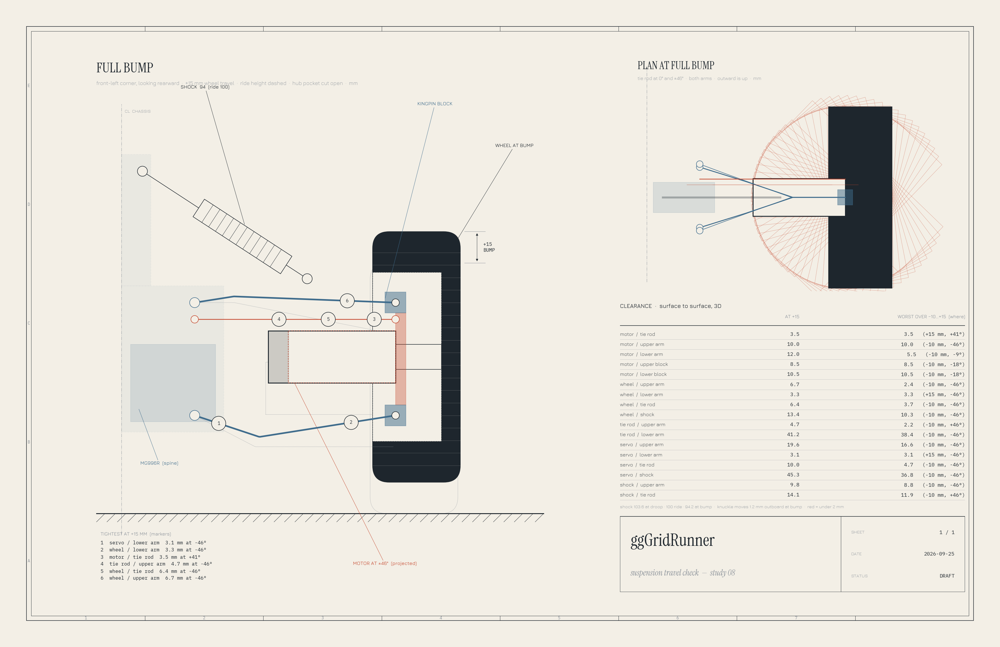

# Chassis & Corner Layout — Design Notes (DRAFT)

**Status:** in progress. **Resume at:** Section 2 detail sign-off (corner parts), then Section 3.
Section 1 (overall layout) is decided: **separate C-upright, straight parallel arms, MG996R on
the upright, 306 × 230, battery fore-aft** (studies 05 and 06, 2026-09-25). This is not an
approved spec. `docs/hardware.md` has **not** been updated to match.

**Drawings**, all generated from the shared dimensions in
[simulation/rover_geometry.py](../../../simulation/rover_geometry.py):
- **Layout** (study 05): [simulation/corner_layout_study.png](../../../simulation/corner_layout_study.png),
  generated by [simulation/corner_layout_study.py](../../../simulation/corner_layout_study.py).
- **Full-bump 3D clearance check** (study 06):
  [simulation/suspension_travel_study.png](../../../simulation/suspension_travel_study.png),
  generated by [simulation/suspension_travel_study.py](../../../simulation/suspension_travel_study.py).

The plan view is forward-up. Rover frame: **+X forward, +Y left, +Z up.**




---

## Goal

Design a 3D-printed chassis and suspension for the rover with four-wheel independent steering
(4WIS, one servo per corner) that can **spin in place** and **crab walk**, printed in sections on
a LulzBot Mini.

## Constraints

| Constraint | Value | Source |
|---|---|---|
| Printer bed | 152 × 152 × 158 mm (LulzBot Mini) | stock spec |
| Design envelope | **140 × 140 × 145 mm** per part | chosen safety margin |
| Wheels | **120 mm Ø × 42 mm**, 12 mm hex, hub pocket **81 mm Ø** | measured |
| Hex seat | hex mating face is **33 mm** in from the wheel's inner (motor-side) face | measured |
| Drive motors | JGA25-370 + encoder, 25 mm Ø, one per wheel, steers with the wheel | in hand |
| Motor length | gearbox face → hex mating face **22 mm**; gearbox + motor **51 mm** + **10 mm** encoder clearance = **61 mm** behind the gearbox face | measured |
| Battery | 4S4P 18650, 144 × 65 × 36 mm (two layers of 8 cells) | in hand |
| Steering servos | **MG996R** (in hand). MG90S also in hand but not used | in hand |
| Reference | the user's orange printed prototype corner (photos, 2026-09-25) | in hand |
| Joints | **no ball joints** (hard to print); pins in nylon bushings only | user preference |

From these, the gearbox face sits **11 mm inside the hub pocket**, and 50 mm of motor sticks out
past the wheel's inner face.

## Decisions so far

1. **Steering range: ±45° commanded, ±50° mechanical clearance.**
2. **Corner: separate C-upright** (the user's idea, study 05).
   - **Knuckle plate:** bolts to the gearbox face inside the hub pocket and steers on a kingpin
     28 mm above and below the axle, which gives **10 mm scrub**.
   - **Upright:** moves with the suspension but doesn't steer.
     - **Prongs:** two, 8 × 10 mm, reaching into the pocket above and below the motor to the
       kingpin pivots.
     - **Back:** joins them 67–75 mm inboard, just outside the motor tail's 62 mm steering sweep.
   - **Why an upright:** the motor, wheel, upright and servo all move together through the travel,
     so **only steering changes the gaps between them**. The arms no longer need dog-legs or
     boomerang shapes, and they never go near the wheel.
3. **Arms: straight, parallel, equal, 50 mm**, hinged with fore-aft pins on the upright's back
   (good for nylon bushings) and on the spine at ±15 mm from the centerline. The inner pivots sit
   **20 mm above** the outer hinges, so the chassis rides higher (belly about 50 mm) and the
   wheels hang lower.
4. **Steering: MG996R on the upright**, on top of the upper prong.
   - **Linkage:** a 1:1 parallelogram link. The 15 mm servo horn and the 15 mm knuckle steering
     arm point fore-aft, and the link runs at z = 78 mm, between the motor top and the upper
     prong.
   - **Bump steer:** none. The servo and knuckle ride on the same part.
   - **Superseded:** the chassis-mounted servo with a long tie rod (study 03/04). The 3D check
     showed the tie rod and arms hitting the pocket rim at full lock.
5. **Shock** from the lower arm (10 mm in from the upright hinge) to a central tower, 100 mm eye
   to eye, top mount at z ≈ 131. It passes through the upper arm's open frame.
6. **Battery lengthwise (144 mm side fore-aft)**, low, on the centerline, held by two side cradles.
7. **Front and rear spines** carry the arm pivots and the shock tower; the center section holds the
   battery. Two lengthwise rails join them. Front and rear spines are the same part.

## Layout study (study 05)

| Measure | Value |
|---|---|
| Track (tire c-c) × wheelbase | **306 × 230** |
| Kingpin c-c / scrub | 286 / 10 mm |
| Spin-in-place angle | 38.8° (solved including scrub) |
| Battery to nearest tire/motor sweep | 56.3 mm |
| Battery end to arm pivot boss | 18.0 mm |
| Footprint | about 348 × 350 mm |

## Full-bump check (study 06)

A true 3D, surface-to-surface check of every pair that could touch. It covers every steering
angle to ±50° and the whole travel, +15 / −10 mm. **Nothing touches.**

| Pair | Smallest gap |
|---|---|
| Wheel (pocket rim) / upper and lower prong | 2.1 mm, at full lock |
| Wheel / link | 3.0 mm, at full lock |
| Motor / link | 3.5 mm |
| Motor / upright back | 4.8 mm |
| Link / upper prong | 4.0 mm |
| Upper arm / servo | 4.8 mm |
| Wheel / servo | 5.8 mm |
| Shock / upper arm | 7.8 mm |
| Motor / prongs | 11.5 mm |
| Wheel / arms | 28.9 mm |

- **Shock length:** 105.5 mm at droop, 90.9 mm at bump, about 15 mm of stroke.
- **Scrub with travel:** the upright moves 3.6 mm outboard at full bump.

### Superseded designs

These are in git history:
- **Study 01:** 240 × 240, kingpin through the tire center, with a 75 mm wheel.
- **Study 02:** 320 × 230, with the kingpin through the motor stub.
- **Studies 03 and 04:** arms straight to the kingpin joints, with the servo on the chassis and a
  tie rod. Study 04's 3D check found the arms hitting the pocket rim at full lock.

## Section 2: Corner module (PROPOSED, awaiting sign-off)

```
 spine ═ upper arm (hinge) ═╗ UPRIGHT back ─ upper prong ─ kingpin pivot ─┐
                            ║   └ MG996R ─ horn ─ link (1:1) ─ steering arm ┤ KNUCKLE PLATE
 spine ═ lower arm (hinge) ═╝ UPRIGHT back ─ lower prong ─ kingpin pivot ─┘   └ JGA25 → hex → wheel
         shock: lower arm → central tower
```

| Part | Proposal | Why |
|---|---|---|
| Kingpin pivots | Vertical pins through the prong ends into bosses on the knuckle plate, in flanged nylon bushings, 56 mm apart | Nylon bushings (user's preference), with wide spacing |
| Arm hinges | Fore-aft pins in nylon bushings at both ends of each arm | Hinges, not ball joints |
| Shock | Standard eyes on pins | Off the shelf |
| Upright | One printed C per corner: prongs 8 × 10 mm, back 8 × 24 mm | Must stay inside the 81 mm pocket at ±50° (2.1 mm margin) |
| Steering | MG996R on the upright, metal 25T horn, flat link with a vertical pin in a nylon bushing at each end | The servo and knuckle ride on the same upright, so the link only swings in a horizontal plane and plain pins work. 1:1 parallelogram, no bump steer |
| Steering stops | Printed hard stops at ±52° | Protect the servo, link and wiring |
| Motor wiring | Service loop near the kingpin axis, then along the lower arm | Near the axis, ±50° only twists the wire instead of pulling it |

- **Servo torque:** steering while stopped at 10 mm scrub takes about 0.06 N·m, plus contact-patch
  twist. The MG996R's ~1 N·m has a large margin.
- **Servo power:** a dedicated **5–6 V, ≥8 A regulator**, separate from the logic buck converter.
- **Unsprung mass** is higher than in study 03, because the upright and servo ride with the wheel.

## Open questions

- Section 2 sign-off: pin and bushing sizes, upright section, and the ±52° stops.
- Wheel travel split: +15 / −10 mm assumed. Confirm against the shocks.
- Inner rise: 20 mm assumed.
- Printer Z height: confirm against the actual machine (158 mm stock).

## Next sections to design

1. **Corner module:** proposed above; finalize after sign-off.
2. **Chassis spines and print split:** spine outline within 140 × 140, pivot bosses at ±15 mm,
   shock tower, rail interface, battery cradles, electronics placement.
3. **Suspension geometry:** shock motion ratio and spring rate, roll behavior.
4. **Validation:** add a print-fit check of every part against the envelope.
5. **Firmware impact** (separate spec): `Steering` class, Ackermann / crab / spin modes (the spin
   angle must include the scrub offset), and four servo PWM pins (see `docs/pinouts.md`).
